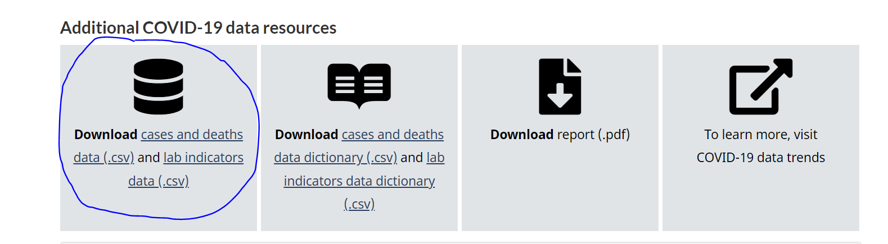

<!-- PROJECT LOGO -->
 

<h3 align="center">Canada COVID-19 Testing & Cases Data Visualizer</h3>

  

    An interactive dashboard built in WinForms with C#, and a MySQL database 
    with the Canada COVID-19 testing and case data. Supply any proper CSV
    file into the program and have the data inserted instantly.
     
     
     
  

<!-- TABLE OF CONTENTS -->

  
Table of Contents

  <ol>
    <li>
      <a href="#about-the-project">About The Project</a>
      <ul>
        <li><a href="#built-with">Built With</a></li>
      </ul>
    </li>
    <li>
      <a href="#getting-started">Getting Started</a>
    </li>
    <li><a href="#usage">Usage</a></li>
    <li><a href="#contact">Contact</a></li>
    <li><a href="#acknowledgments">Acknowledgments</a></li>
  </ol>

<!-- ABOUT THE PROJECT -->
## About The Project

 

This project is dashboard that contains a pie chart and line chart to visualize Canada's COVID-19 testing and case
data. The data supplied to the program in a form of a CSV file (see <a href="#getting-started">Getting Started</a> for
where to find the CSV files.) which is then inserted into a MySQL database. (script in repo as well). This project
allows you do use the Canadian government's provided data and visualize the data by Canada as a whole, by province, and
time-range.

(<a href="#readme-top">back to top</a>)

### Built With

* [![WinForms][.NET]][.NET-url]
* [![My-SQL][MySQL]][MySQL-url]
* [![CSharp][C-sharp]][Csharp-url]

(<a href="#readme-top">back to top</a>)

<!-- GETTING STARTED -->
## Getting Started

To get started, you must have MySQL installed. Run the SQL script located in the root directory of this repo titled
<b>database-creation.sql</b>. This script will create a database for this progam with the necessary fields needed.
 
You will also need to change the connectionString to your credentials. From this repo root directory, go to DataVisualizer -> DataVisualizer -> App.config. Change it to your details. Screenshot attached for convenience.

To get started, you will first need to have Visual Studio installed. If only wanting to test the program without 
running Visual Studio, go to DataVisualizer -> DataVisualizer -> bin -> Debug -> DataVisualizer.exe. <b>NOTE:</b> if
you do this, you will need to change the connectionString in the <b>DataVisualizer.exe.config</b> file as well.
  
When the program is open, start with clicking the "Load Data" button found on the left hand side menu. It will
open a new small window where you can load in the 2 CSV files needed. If you don't have the Canadian goverment's
two COVID-19 data CSV files needed, you have two options:  

<i>If you want to use the CSV files that are supplied with this program:</i> 
This repo has two CSV files for your convience that are taken from the Canadian Goverment's website. These are
located in the root directory of this repo, titled <b>covid19-download.csv</b> (this is the CASE DATA) and 
<b>covid19-epiSummary-labIndicators.csv</b> (this is the TESTING DATA). 

  
<i>If you want to use the CSV files form the Goverment of Canada's site:</i> 
Follow this link: <a href="https://health-infobase.canada.ca/covid-19/">https://health-infobase.canada.ca/covid-19/</a>
, we will be using the “COVID-19 daily epidemiology update” data found on the bottom of that linked page. Download the "cases and deaths data (.csv)" and the "lab indicators data (.csv)". The lab indicators file is the TESTING DATA and 
the cases and deaths data is the CASE DATA. The goverment website may be complicated to navigate, refer to this
screenshot to help locating the two files for download:

  
Now that you have both files, you can continue with the program by clicking the "Load Data" button and load both files
in. Once the program as stated that both files have been loaded into the MySQL database successfully, you may press the
"Continue" button. Now, press the "Start Program" button, and all of the data will be visualized for you in two seperate
charts as seen in the image at the top of this readme.
  
If you would like to reset the charts to the default, simply press the "Start Program" button again.
  

<b>IMPORTANT NOTE:</b> Canada released data on every saturday, so only saturdays will have corrosponding data when
selecting a date. The program will prompt you with an warning if a non-saturday date has been selected.

 
 

<!-- USAGE EXAMPLES -->
## Usage

Once the program is running, you will be able to customize the output of the data on the charts depending on the location
and date range you give it.  

 

Example of loading in the CSV file data and having the charts populate in the program.

 

Example of changing the time range for the pie chart to show the number of cases changing per province.

 

Example of changing the date range for the line chart, and the location, to show corrosponding data.

 

Example of pressing the "Start Program" button again to set the charts to their default.

(<a href="#readme-top">back to top</a>)

<!-- CONTACT -->
## Contact

Briana R. E. Burton - [in/briana-burton/](https://www.linkedin.com/in/briana-burton/) - brianareburton@gmail.com

Project Link: [https://github.com/bburton0334/canada_covid_data_visualizer](https://github.com/bburton0334/canada_covid_data_visualizer)

(<a href="#readme-top">back to top</a>)

<!-- ACKNOWLEDGMENTS -->
## Acknowledgments

* I am not responsible for someone maliciously copying this source code with the intent of submitting it as their own for an assignment.

(<a href="#readme-top">back to top</a>)

<!-- MARKDOWN LINKS & IMAGES -->
[.Net]: https://img.shields.io/badge/.NET-5C2D91?style=for-the-badge&logo=.net&logoColor=white
[.Net-url]: https://learn.microsoft.com/en-us/dotnet/desktop/winforms/overview/?view=netdesktop-7.0
[MySQL]: https://img.shields.io/badge/mysql-%2300f.svg?style=for-the-badge&logo=mysql&logoColor=white
[MySQL-url]: https://www.mysql.com/
[WPF]: https://img.shields.io/badge/wpf-000000?style=for-the-badge&logo=xaml&logoColor=white
[WPF-url]: https://visualstudio.microsoft.com/vs/features/wpf/
[C-sharp]: https://img.shields.io/badge/C%23-000000?style=for-the-badge&logo=csharp&logoColor=white
[Csharp-url]: https://docs.microsoft.com/en-us/dotnet/csharp/
[Azure]: https://img.shields.io/badge/azure-000000?style=for-the-badge&logo=microsoftazure&logoColor=white
[Azure-url]: https://azure.microsoft.com/en-us/
[Service]: https://img.shields.io/badge/windows%20service-000000?style=for-the-badge&logo=windows&logoColor=white
[Service-url]: https://docs.microsoft.com/en-us/dotnet/framework/windows-services/introduction-to-windows-service-applications